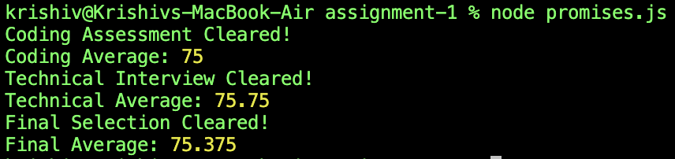

# Promise-Based Recruitment Evaluation System

## Overview

This project demonstrates how **JavaScript Promises** can be used to model a real-world recruitment process.

The recruitment process contains three stages:

1. **Coding Assessment**
2. **Technical Interview**
3. **Final Selection Review**

Each stage returns a Promise and takes **2 seconds** to complete using `setTimeout()`. A candidate proceeds to the next stage only if the current stage is successfully cleared.

---

## Technologies Used

* JavaScript
* Promises
* `setTimeout()`
* `.then()`
* `.catch()`

---

## How It Works

### 1. Coding Assessment

The `codingTest(scores, limit)` function:

* Accepts an array of coding assessment scores.
* Accepts a cutoff/limit.
* Calculates the average score.
* Waits for 2 seconds before completing.
* Resolves with the average if the average is greater than or equal to the limit.
* Rejects with a failure message if the candidate does not meet the cutoff.

```javascript
function codingTest(scores, limit) {
    return new Promise((resolve, reject) => {
        setTimeout(() => {
            let sum = 0;

            for (let i = 0; i < scores.length; i++) {
                sum += scores[i];
            }

            let result = sum / scores.length;

            if (result >= limit) {
                resolve(result);
            } else {
                reject("Not cleared the Coding Assessment.");
            }
        }, 2000);
    });
}
```

### 2. Technical Interview

The `interviewTest(scores, limit)` function works similarly:

* Accepts technical interview scores.
* Calculates the average.
* Waits for 2 seconds.
* Resolves with the average when the cutoff is cleared.
* Rejects if the average is below the cutoff.

```javascript
function interviewTest(scores, limit) {
    return new Promise((resolve, reject) => {
        setTimeout(() => {
            let sum = 0;

            for (let i = 0; i < scores.length; i++) {
                sum += scores[i];
            }

            let result = sum / scores.length;

            if (result >= limit) {
                resolve(result);
            } else {
                reject("Not cleared the Technical Interview.");
            }
        }, 2000);
    });
}
```

### 3. Final Selection

The `selectionTest(codingResult, interviewResult, limit)` function:

* Receives the coding assessment average.
* Receives the technical interview average.
* Calculates the final average of both scores.
* Waits for 2 seconds.
* Resolves with the final average if it meets the final cutoff.
* Rejects otherwise.

```javascript
function selectionTest(codingResult, interviewResult, limit) {
    return new Promise((resolve, reject) => {
        setTimeout(() => {
            let result = (codingResult + interviewResult) / 2;

            if (result >= limit) {
                resolve(result);
            } else {
                reject("Not cleared the final selection cutoff.");
            }
        }, 2000);
    });
}
```

---

## Test Data

### Coding Assessment

```javascript
[68, 74, 81, 77]
```

Coding cutoff:

```javascript
65
```

Average:

```text
(68 + 74 + 81 + 77) / 4 = 75
```

Since `75 >= 65`, the Coding Assessment is cleared.

### Technical Interview

```javascript
[72, 69, 78, 84]
```

Technical Interview cutoff:

```javascript
65
```

Average:

```text
(72 + 69 + 78 + 84) / 4 = 75.75
```

Since `75.75 >= 65`, the Technical Interview is cleared.

### Final Selection

Final cutoff:

```javascript
70
```

Final average:

```text
(75 + 75.75) / 2 = 75.375
```

Since `75.375 >= 70`, the candidate clears the final selection.

---

## Expected Output

```text
Coding Assessment Cleared!
Coding Average: 75

Technical Interview Cleared!
Technical Average: 75.75

Final Selection Cleared!
Final Average: 75.375
```

Each stage takes approximately **2 seconds**, so the complete successful process takes approximately **6 seconds**.

---

## Output Screenshot

