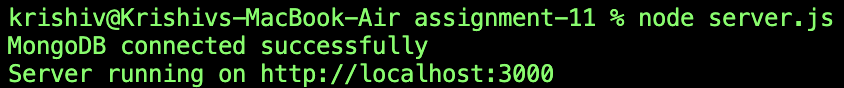
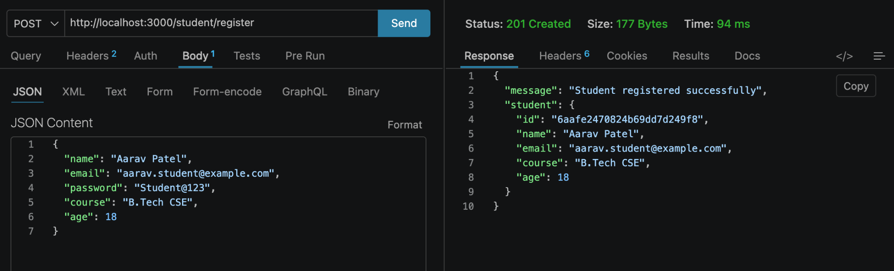
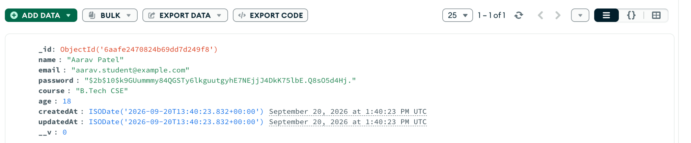
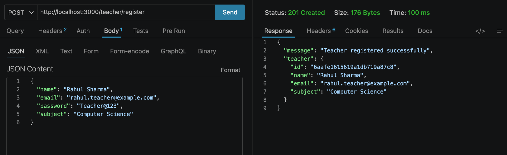
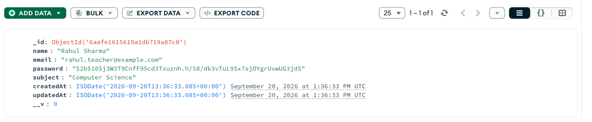
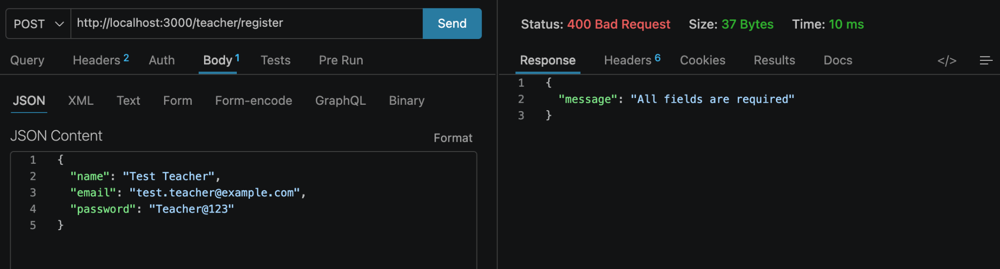

## Assignment 11

A RESTful backend API built with **Express.js**, **MongoDB**, **Mongoose**, and **bcrypt**, following a clean modular architecture for teacher and student registration.

---

## Objective

The objective of this assignment is to:
- Connect an Express.js backend application to **MongoDB** using **Mongoose**.
- Create separate Mongoose models and schemas for teachers and students.
- Implement `POST /teacher/register` and `POST /student/register` endpoints for user registration.
- Validate required registration fields before creating a document.
- Hash passwords securely using **bcrypt** before storing them in MongoDB.
- Prevent duplicate registrations by checking whether an email address already exists.
- Return appropriate HTTP status codes and structured responses for successful registration (`201 Created`), missing fields (`400 Bad Request`), duplicate emails (`409 Conflict`), and server errors (`500 Internal Server Error`).
- Organize the project into dedicated `model/`, `schema/`, and `router/` modules.
- Test and verify the API using **Thunder Client** and inspect stored documents in **MongoDB**.

## Screenshots

### 1. MongoDB Connection and Server Startup
Server initialization on port 3000 confirming a successful MongoDB connection.

---

### 2. Successful Student Registration
Thunder Client executing a `POST` request to `/student/register` with valid student data and returning `201 Created`.

---

### 3. Student Document in MongoDB
MongoDB showing the newly created student document with the password stored as a bcrypt hash.

---

### 4. Successful Teacher Registration
Thunder Client executing a `POST` request to `/teacher/register` with valid teacher data and returning `201 Created`.

---

### 5. Teacher Document in MongoDB
MongoDB showing the newly created teacher document with the password stored as a bcrypt hash.

---

### 6. Registration Error Handling
Thunder Client testing invalid or duplicate registration data and displaying the corresponding error response.

---
