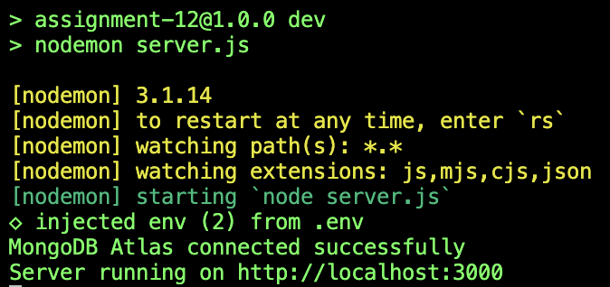
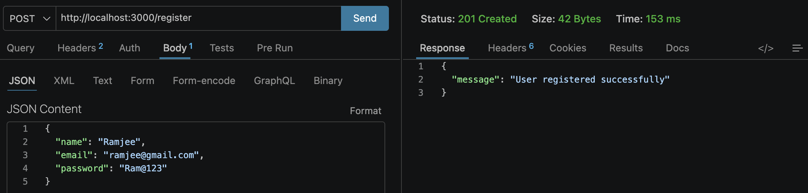
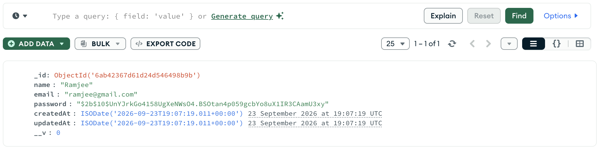
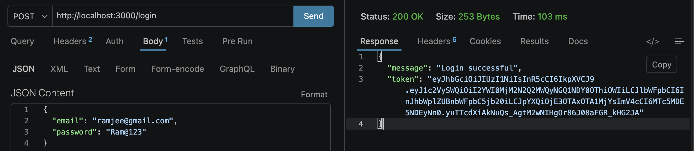
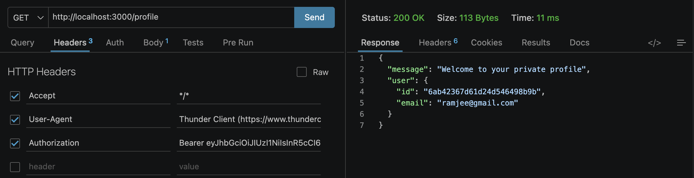
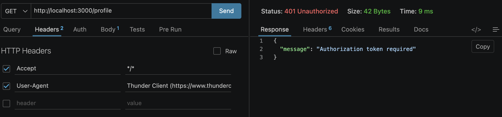

## Assignment 12

A RESTful authentication API built with **Express.js**, **MongoDB**, **Mongoose**, **bcrypt**, **JSON Web Tokens (JWT)**, and **dotenv**.

---

## Objective

The objective of this assignment is to:
- Connect an Express.js backend application to **MongoDB Atlas** using **Mongoose**.
- Create a reusable user model for storing name, email, and password information.
- Implement `POST /register` and `POST /login` authentication endpoints.
- Validate required fields before processing requests.
- Hash passwords securely using **bcrypt** before storing them in MongoDB.
- Prevent duplicate registrations by checking whether an email address already exists.
- Generate a JWT after successful login.
- Protect the `GET /profile` endpoint with JWT authentication middleware.
- Return appropriate HTTP status codes and structured JSON responses for successful requests and errors.
- Organize the project into separate `models/`, `controllers/`, `middleware/`, and `routes/` modules.
- Test and verify the API using **Thunder Client** and inspect stored users in **MongoDB Atlas**.

---

## Screenshots

### 1. MongoDB Connection and Server Startup

Server initialization confirming a successful MongoDB Atlas connection and server startup.

---

### 2. Successful User Registration

Thunder Client executing a `POST` request to `/register` with valid user data and returning `201 Created`.

---

### 3. User Document in MongoDB

MongoDB Atlas showing the registered user document with the password stored as a bcrypt hash.

---

### 4. Successful Login

Thunder Client executing a `POST` request to `/login` and receiving a JWT token.

---

### 5. Protected Profile Request

Thunder Client executing a `GET` request to `/profile` with a valid Bearer token and receiving the authenticated user's profile.

---

### 6. Authentication Error Handling

Thunder Client testing missing fields, duplicate registration, invalid credentials, and invalid or expired tokens.

---
