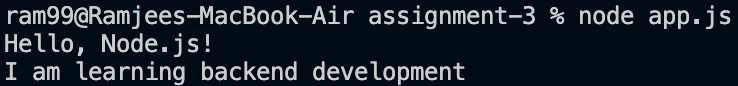
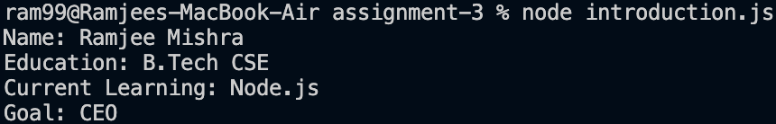

# Node.js Basics Assignment

## Assignment Description

This assignment is about creating simple Node.js programs and displaying
output in the terminal using console.log().

## Files

- app.js - Prints basic Node.js messages.
- introduction.js - Prints my personal introduction.

## Steps to Run

1. Open the assignment folder in VS Code.
2. Open the terminal.
3. Run the first program:

node app.js

4. Run the introduction program:

node introduction.js

## Commands Used

node app.js

node introduction.js

## Output Screenshots

### App.js Output

### Introduction.js Output

