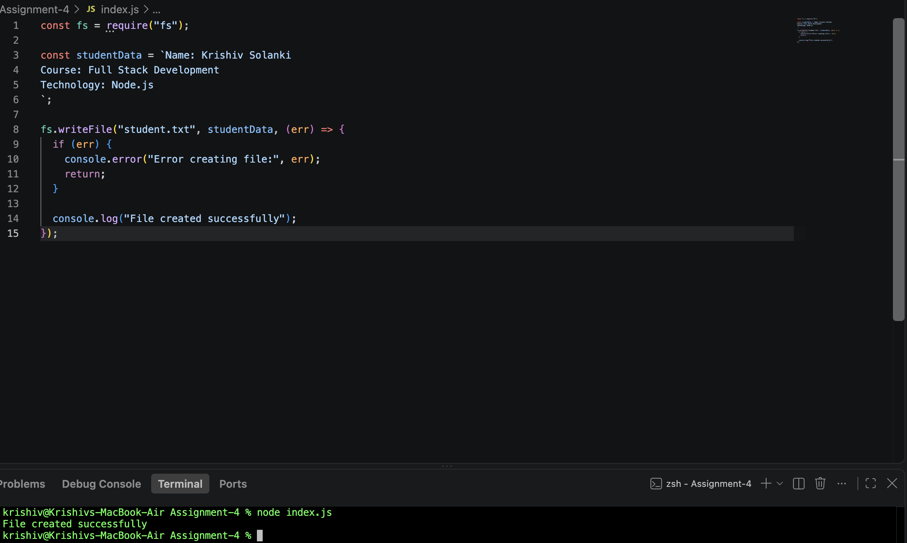
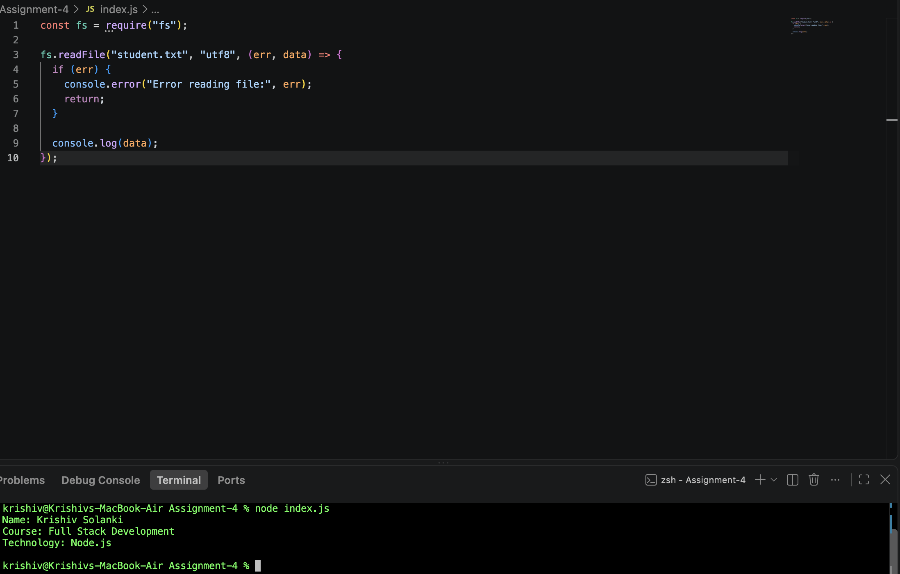
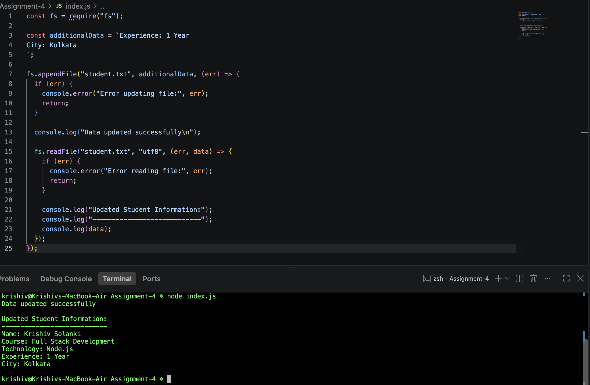
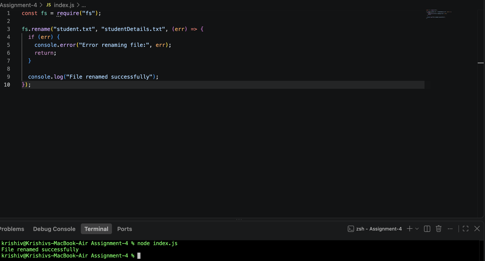
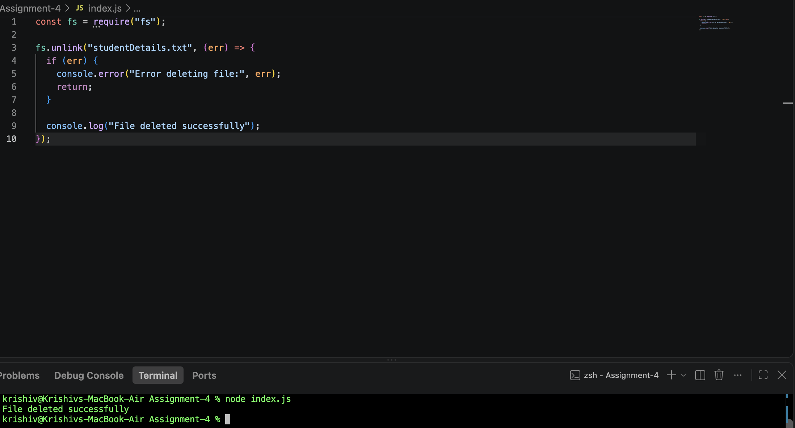

# File System Assignment

## Student Details

- **Name:** Krishiv Solanki
- **Course:** Full Stack Development
- **Technology:** Node.js

## About the Assignment

This assignment demonstrates basic file handling operations in Node.js using the built-in `fs` (File System) module.

The program performs the following operations:

1. Creates and writes student information to a file using `fs.writeFile()`.
2. Reads the file using `fs.readFile()`.
3. Updates the file using `fs.appendFile()`.
4. Renames the file using `fs.rename()`.
5. Deletes the file using `fs.unlink()`.

## Files

```text
Assignment-4/
├── Screenshots/
│   ├── Delete-File.png
│   ├── File-Creation.png
│   ├── Reading-File.png
│   ├── Rename-File.png
│   └── Updating-File.png
├── index.js
├── package.json
└── README.md
```

## How to Run

Make sure Node.js is installed.

Run the program:

```bash
node index.js
```

## Expected Output

When the program is executed using:

```bash
node index.js
```

The terminal displays the following output:

```text
File created successfully

Student Information:
--------------------
Name: Krishiv Solanki
Course: Full Stack Development
Technology: Node.js

Data updated successfully

Updated Student Information:
----------------------------
Name: Krishiv Solanki
Course: Full Stack Development
Technology: Node.js
Experience: 1 Year
City: Kolkata

File renamed successfully
Do you want to delete studentDetails.txt? (yes/no):
```

### If the user enters `yes`

```text
Do you want to delete studentDetails.txt? (yes/no): yes
File deleted successfully
```

The file `studentDetails.txt` is permanently deleted.

### If the user enters `no`

```text
Do you want to delete studentDetails.txt? (yes/no): no
File was not deleted.
```

The file `studentDetails.txt` is kept in the project directory.

## File System Methods Used

| Method | Purpose |
|---|---|
| `fs.writeFile()` | Creates and writes to a file |
| `fs.readFile()` | Reads file contents |
| `fs.appendFile()` | Adds data to an existing file |
| `fs.rename()` | Renames a file |
| `fs.unlink()` | Deletes a file |

## Output

### 1. File Creation

The screenshot below shows the successful creation of `student.txt` using `fs.writeFile()`.



---

### 2. Reading File

The screenshot below shows the student information being read from `student.txt` using `fs.readFile()`.



---

### 3. Updating File

The screenshot below shows the additional student information being added using `fs.appendFile()`.



---

### 4. Renaming File

The screenshot below shows the file being renamed from `student.txt` to `studentDetails.txt` using `fs.rename()`.



---

### 5. Deleting File

The screenshot below shows the confirmation and successful deletion of `studentDetails.txt` using `fs.unlink()`.

