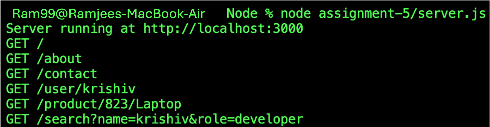

# Assignment-5

The assignment covers:

- Basic routes
- Dynamic route parameters
- Multiple route parameters
- Query parameters
- Request-response handling
- Request logging using middleware

---

# Task 1: Basic Routes

This task demonstrates how to create basic GET routes using Express.js.

The following routes are implemented:

```text
GET /
GET /about
GET /contact
```

---

# Task 2: Route Parameter (Dynamic Route)

This task demonstrates how to accept a dynamic value from the URL.

The route created is:

```text
GET /user/:name
```

The `:name` part is a **route parameter**.

The value can be accessed using:

```javascript
req.params.name
```

---

# Task 3: Multiple Route Parameters

This task demonstrates how to handle multiple dynamic values from a URL.

The route created is:

```text
GET /product/:id/:category
```

There are two route parameters:

- `id`
- `category`

They can be accessed using:

```javascript
req.params.id
req.params.category
```

---

# Task 4: Query Parameters

This task demonstrates how to read data using **query parameters**.

The route created is:

```text
GET /search
```

Query parameters are added to the URL after a `?`.

For example:

```text
/search?name=john&role=developer
```

The application reads two query parameters:

- `name`
- `role`

They are accessed using:

```javascript
req.query.name
req.query.role
```

---

# Task 5: Request-Response Understanding

This task demonstrates how to access information about incoming HTTP requests.

Middleware is used to log the request method and URL for every incoming request.

The middleware is:

```javascript
app.use((req, res, next) => {
    console.log(`${req.method} ${req.originalUrl}`);
    next();
});
```

---

# Sample Terminal Output

After making requests to different routes, the terminal will display output similar to:

```text
Server running at http://localhost:3000

GET /
GET /about
GET /contact
GET /user/john
GET /product/101/electronics
GET /search?name=john&role=developer
```

This confirms that the request method and URL are being logged correctly.

---

# Complete Route List

| Method | Route | Description |
|--------|-------|-------------|
| GET | `/` | Displays the Home Page |
| GET | `/about` | Displays the About Page |
| GET | `/contact` | Displays the Contact Page |
| GET | `/user/:name` | Displays a greeting using a dynamic name |
| GET | `/product/:id/:category` | Displays product ID and category |
| GET | `/search` | Reads and displays query parameters |

---

# Sample Requests and Responses

### Request 1

```text
GET /
```

Response:

```text
Welcome to Home Page
```

---

### Request 2

```text
GET /about
```

Response:

```text
This is About Page
```

---

### Request 3

```text
GET /contact
```

Response:

```text
This is Contact Page
```

---

### Request 4

```text
GET /user/Ramjee
```

Response:

```text
Hello Ramjee
```

---

### Request 5

```text
GET /product/101/electronics
```

Response:

```text
Product ID: 101, Category: electronics
```

---

### Request 6

```text
GET /search?name=Ramjee&role=developer
```

Response:

```text
Name: Ramjee, Role: developer
```

---

# Screenshots

The screenshot below shows the terminal output of server.js.


