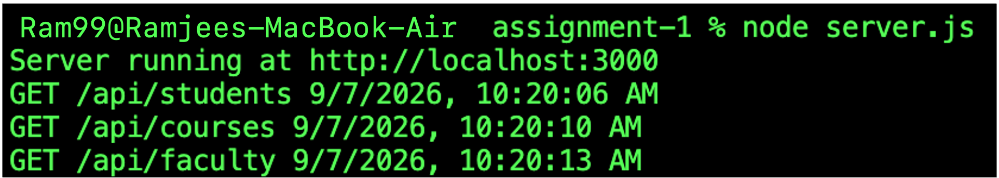
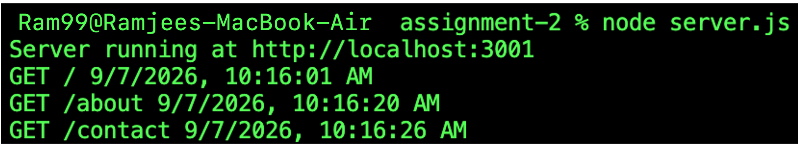
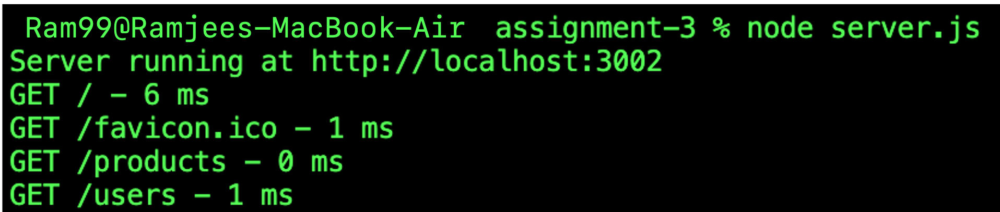

# Express Middleware Assignments

This folder contains three small Express.js assignments demonstrating how middleware works in a Node.js application.

## Assignments

### Assignment 1: Router Middleware

This assignment uses an Express router and applies middleware only to the `/api` routes.

Run it with:

```bash
cd Assignment-1
node server.js
```

Server: `http://localhost:3000`

Routes:

- `/`
- `/api/students`
- `/api/courses`
- `/api/faculty`

Screenshot:



### Assignment 2: Global Logger Middleware

This assignment creates custom middleware that logs the request method, URL, and date and time for every request.

Run it with:

```bash
cd Assignment-2
node server.js
```

Server: `http://localhost:3001`

Routes:

- `/`
- `/about`
- `/contact`

Screenshot:



### Assignment 3: Response Time Middleware

This assignment measures how long each request takes and logs the response time after the response is finished.

Run it with:

```bash
cd Assignment-3
node server.js
```

Server: `http://localhost:3002`

Routes:

- `/`
- `/products`
- `/users`

Screenshot:

