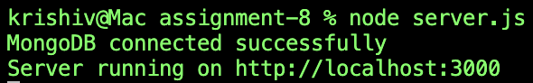
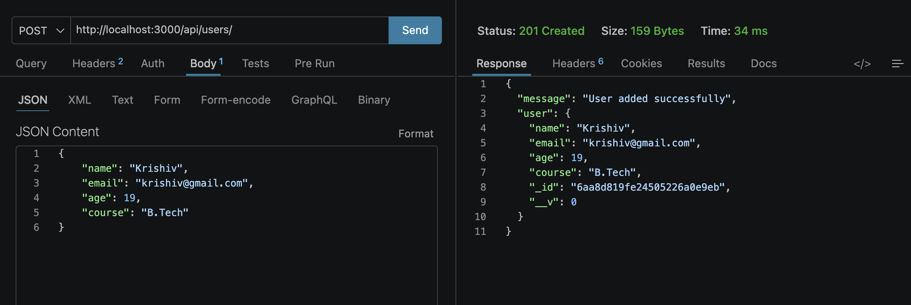
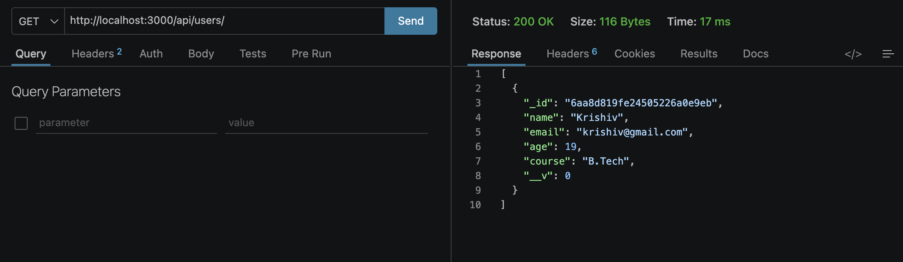
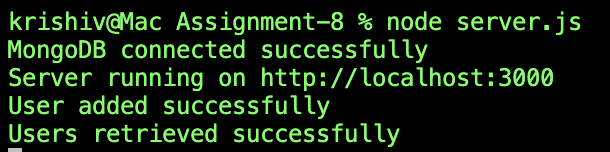
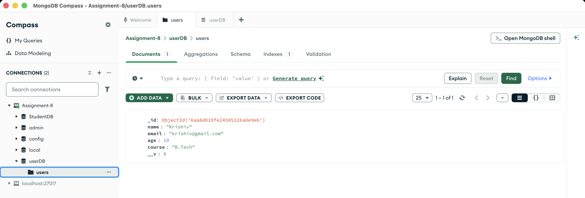

# Assignment 8

## Objective
The goal of this assignment is to build a simple REST API using **Node.js**, **Express.js**, and **MongoDB** (via **Mongoose**) that allows users to be added to and retrieved from a database.

## Tech Stack
- Node.js
- Express.js
- MongoDB
- Mongoose (ODM)
- Postman (for API testing)
- MongoDB Compass (for viewing the database)

## Project Structure
```
Assignment-8/
├── server.js
├── model/
│   └── userModel.js
├── schema/
│   └── userSchema.js
└── router/
    └── userRouter.js
```

## User Schema
Each user document contains the following fields:

| Field  | Type   | Required |
|--------|--------|----------|
| name   | String | Yes      |
| email  | String | Yes      |
| age    | Number | Yes      |
| course | String | Yes      |

## API Endpoints

| Method | Endpoint     | Description              |
|--------|--------------|---------------------------|
| POST   | `/api/users` | Add a new user to the DB  |
| GET    | `/api/users` | Retrieve all users        |

## How It Works
1. `server.js` connects to MongoDB and starts the Express server on port `3000`.
2. `userRouter.js` defines the `POST` and `GET` routes for `/api/users`.
3. `userModel.js` and `userSchema.js` define the Mongoose schema and model used to store user data in the `userDB` database.

## Running the Project
```bash
npm install
node server.js
```

On successful startup, the console shows:



## Testing the API (Postman)

### 1. Adding a User — `POST /api/users`
A new user is added by sending a JSON body with `name`, `email`, `age`, and `course`. The server responds with `201 Created` and the saved user document.



### 2. Retrieving Users — `GET /api/users`
Fetching all users returns a `200 OK` response with an array of user documents.



### 3. Server Console Logs
The terminal confirms each operation as it happens:



## Verifying Data in MongoDB Compass
The saved user document can also be verified directly in the `userDB.users` collection using MongoDB Compass.



## Conclusion
This assignment demonstrates building a basic CRUD-style REST API with Express and MongoDB, including connecting to a database, defining a schema/model, creating routes, and testing endpoints using Postman.